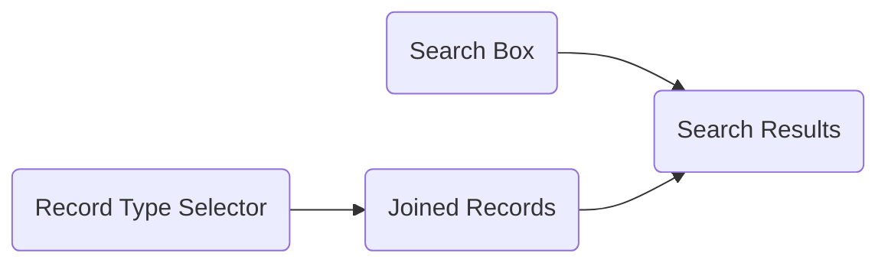

> [!info] This is now built-in to Marimo, so you don't need to hack this yourself anymore!
> Marimo has added [SQL support powered by DuckDB](https://x.com/marimo_io/status/1805645628942544935). It's awesome!

I recently starting playing with [Marimo](https://marimo.io/), a new Python notebook that aims to solve some of the problems with Jupyter notebook environments. 

It's awesome, and it feels great to work with.

One of the major benefits is automatic dependency tracking of variables across notebook cells.

The benefits this creates include:
- Deterministic and reproducible execution
- Prevention of circular dependencies or two cells defining the same variable
- Automatic re-calculation of dependent cells when code or data changes

These features are great for any type of data exploration or general non-application programming, but are specifically close to the way data analysts often incrementally build up SQL transformations.

## DuckDB's Relational API

Enter [DuckDB](https://duckdb.org), an embedded OLAP database system (like SQLite, but columnar/for analytics). Because DuckDB is embedded, it's integration with Python is pretty deep, and not a simple wrapper over a network protocol.

That makes some use cases like this (taken straight from the docs) possible:
```python
import duckdb
rel = duckdb.sql("SELECT * FROM range(1000000) tbl(id)")
duckdb.sql("SELECT sum(id) FROM rel").show()
```

```
┌──────────────┐
│   sum(id)    │
│    int128    │
├──────────────┤
│ 499999500000 │
└──────────────┘
```

As you can see, the referenced `rel` on line 3 of this query is a Python variable. It's not a table that exists in the DuckDB database.

The explanation of what's happening here in the docs is as follows:

> The Relational API is an alternative API that can be used to incrementally construct queries. The API is centered around `DuckDBPyRelation` nodes. The relations can be seen as symbolic representations of SQL queries. They do not hold any data - and nothing is executed - until a method that triggers execution is called.

I feel like the docs don't emphasize enough how unusual this is compared to a standard database API. Usually, I am either constructing a query using an ORM/query builder **or** I am executing a query, which involves a round trip across the network and real work in the database.

This is something else, and it's powerful. The closest thing to this in a client/server database system would be either a view or a CTE: both some expression of a relation that is resolved at query time.

However, even though views contain no data and are similarly just incorporated into the execution of a query that references them, their definition is stored in the database. Iterating over complex transformations requires continually creating and dropping or replacing them.

CTE's, on the other hand, are as ephemeral as Python DuckDB relations, but constructing a large chain of them requires annoying string manipulation.

In addition, these relations can be "forked" or extended:

```python
people_with_managers = db.sql("""
  select e.id, e.department, e.name as employee_name,
    m.name as manager_name
  from people e 
  join people m on m.id = e.manager_id
""")

people_with_managers_in_shipping = people_with_managers.filter("department = 'shipping'")

people_with_managers_in_billing = people_with_managers.filter("department = 'billing'")
```

These last two relations share no similarity - they just extend the same base relation.

They can also be constructed conditionally:
```python
base_relation = db.sql("""
  select id, first_name, last_name from employees
""") if record_type = 'employees' else db.sql("""
  select id, first_name, last_name from customers
""")
```

And a subsequent query can use `base_relation` without knowing which underlying table is being referred to. This type of thing is not possible in SQL without a view wrapping several unions, which may have significant runtime performance penalties.

Relations have a few key methods:
- `.show()` - prints the first 10 rows of the relation. This executes the query with a limit 10.
- `.df()` / `.pl()` - executes the query and turns it into a Pandas / Polars dataframe
- `arrow()` - executes the query and stores the results inside a Python arrow table in memory. Due to DuckDB's high compatibility with the arrow ecosystem, I believe that this is a zero-copy operation: it does not require de-serializing and re-serializing the data into either native Python data structures or Pandas dataframes. Polars is arrow based, so I'm not sure what level of re-serialization is involved there.

## Use in Marimo

Inside of Marimo, this becomes really valuable, after some clever tricks. 

At first, when you get  everything seemed fine. 

![[Screenshot 2024-02-04 at 3.40.04 PM 1.png]]

I was able to use the Relational API as documented. However, things got a bit more tricky when I tried to take advantage of the reactive nature of cells, and spread things out a bit.

At first, this worked:
![[Screenshot 2024-02-04 at 3.41.06 PM 1.png]]

But it was inconsistent. Often, I would get an error in the second cell that `numbers` was not a defined relation, especially when the notebook was first booting up.

The reason for this became clear when I popped open Marimo's dependency visualizer on the left. Even though `cell-2` was using the variable numbers, it wasn't registered as a use by Marimo. This I assume has to do with the way DuckDB implements its "replacement scans", which must not surface the use of variable in a way that is visible to Marimo.

![[Screenshot 2024-02-04 at 3.42.56 PM 1.png]]

Even when the query in `cell-2` ran, it wasn't be automatically re-run when I changed the query in `cell-1`, which was key to my goal of glorious reactive chains of SQL.

The solution needed to involve using the specific variable `numbers` in way that would let Marimo know the second cell was dependent, but also render in the SQL string as the literal text "numbers".

I considered using wrapping classes, like:
```python
class WrappedRelation:
	def __init__(self, name, relation):
		self.name = name
		self.relation = relation
```

But this doesn't work:
![[Screenshot 2024-02-04 at 3.50.21 PM 1.png]]

Because although `numbers.name` is equivalent to `numbers`, and `numbers` is in scope and tracked as a dependency, `nambers.name` is a string, and not a DuckDB relation.

After a good bit of digging and several failed solutions using the `f-string` `__repr__` operator , the solution I ultimately found is this little function I'm naming `r`, which works by inspecting the stack of the calling function to find the name of it's local reference.
```python
import inspect

def r(sql_result):
	locals_at_caller = inspect.currentframe().f_back.f_locals.items()
	name = None
	for var_name, var_value in locals_at_caller:
		if var_value is sql_result:
			return var_name
```

Which works well, and properly results in a tracked dependency between the two cells.

![[Screenshot 2024-02-04 at 3.52.55 PM 1.png]]

![[Screenshot 2024-02-04 at 3.53.28 PM 1.png]]

The result is very cool! Fully reactive re-evaluation of dependent cells. When I change the `100` in range to any other number, the new count is printed without any extra button click.

## Materialization

Marimo makes it really easy to add quick UI elements to your notebook whose values are then fed into the execution of your cells. When you get the hang of it, it feels like it can get 50% of the way there to the power of ReTool for building quick internal applications.

One downside of this fully lazy DuckDB relation approach is that you may end up re-computing more than you want, especially when connected to UI elements.

Imagine the following dependency graph:



With this approach, I built a notebook that churned through around 10 million records, each of which was differently constructed using the conditional relation construction approach I shared above (with `customers` vs. `employees`.)

However, it was a bit slow (a few seconds to turn up new search results) because the construction of the joined records was pretty expensive. This was computational work that didn't need to be done in response to a new search term, and so the responsiveness of the notebook to changes in search terms could be improved with materialization.

**Dead simple in-memory materialization: `.arrow()`**:

The absolute simplest way to solve this is surprisingly easy: add a call to `.arrow()` to the result of any relation construction call. With the numbers example above, that would just look like this:

![[Screenshot 2024-02-04 at 4.15.19 PM 1.png]]

It's too easy.

The downside is that these results are stored in memory. If the computation is expensive but doesn't return that much data, that might be a good and easy choice.

**Storing results in a DuckDB table, and returning a relation:**

The other way is to store results in a DuckDB table. In the example I'm playing with here, I'm using an in-memory DuckDB database, but it can be disk backed as well.

I define a simple function below:
```python
def materialize(db, name, relation):
    db.execute(f"drop table if exists {name}")
    relation.to_table(name)
    return db.table(name)
```

And then can use that function to wrap any relation.

![[Screenshot 2024-02-04 at 4.21.48 PM 1.png]]

 Now, whenever that cell is re-computed, it will save the results as a table. The way that a caller uses the stored table does not need to change.

I initially was using the same local inspection strategy to determine the name of the table, but I realized over time that it's actually not a stable result. Based on the way Marimo may choose to execute your cells, it may rename your variables. It will always be a variable in the local scope, but it may not always have the same name to the caller. 

## Conclusion

I'm pretty happy, and excited to keep using this for data exploration, transformation, and quick interactive applications on top of it!